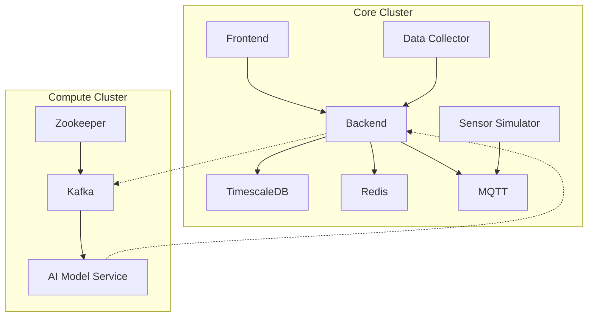

# GitHub Actions Workflows

이 디렉토리는 Smart Factory 프로젝트의 CI/CD 워크플로우들을 관리합니다.

## 🚀 활성 워크플로우

### `core-cluster-deploy.yml`
- **목적**: Core 서비스들을 전용 클러스터에 배포
- **포함 서비스**: 
  - Frontend (React)
  - Backend (FastAPI)
  - Redis (캐싱)
  - MQTT (메시징)
  - Sensor Simulator
  - Data Collector
  - TimescaleDB (시계열 데이터)
- **클러스터**: `core-cluster` (us-central1)
- **최적화**: 오토스케일러, 비용 절감 (preemptible 인스턴스)

### `compute-cluster-deploy.yml`
- **목적**: 컴퓨팅 집약적 서비스들을 전용 클러스터에 배포
- **포함 서비스**:
  - Kafka (스트리밍 데이터)
  - Zookeeper (Kafka 관리)
  - AI Model Service (머신러닝)
- **클러스터**: `compute-cluster` (us-central1)
- **최적화**: 메모리 최적화 머신 타입 (e2-highmem)

### `frontend-ci.yml`
- **목적**: 프론트엔드 CI/CD 파이프라인
- **기능**: 린트, 테스트, 빌드 검증

## 🏗️ 아키텍처 개요



## 🔧 트리거 조건

### Core Cluster 배포
- **경로**: `backend/**`, `frontend/**`
- **브랜치**: `main`, `develop`

### Compute Cluster 배포
- **경로**: `backend/app/services/ai_model_service.py`, `backend/app/ml/**`
- **브랜치**: `main`, `develop`

## 📋 필수 Secrets

### 필수 설정
- `GCP_PROJECT_ID`: GCP 프로젝트 ID
- `GCP_SA_KEY`: 서비스 계정 JSON 키
- `POSTGRES_PASSWORD`: PostgreSQL 비밀번호

### 배포 후 설정
- `COMPUTE_CLUSTER_KAFKA_ENDPOINT`: Kafka 외부 엔드포인트
- `COMPUTE_CLUSTER_AI_ENDPOINT`: AI 서비스 외부 엔드포인트

## 🗂️ 디렉토리 구조

```
.github/workflows/
├── README.md                    # 이 파일
├── core-cluster-deploy.yml      # Core 클러스터 배포
├── compute-cluster-deploy.yml   # Compute 클러스터 배포
├── frontend-ci.yml             # 프론트엔드 CI
└── legacy/                     # 레거시 워크플로우
    ├── README.md
    ├── backend-deploy.yml      # [LEGACY] 단일 클러스터 백엔드 배포
    └── frontend-deploy.yml     # [LEGACY] 단일 클러스터 프론트엔드 배포
```

## 🚨 중요사항

1. **배포 순서**: Compute Cluster를 먼저 배포한 후 Core Cluster를 배포해야 합니다.
2. **외부 IP**: Compute Cluster 배포 완료 후 외부 IP를 확인하여 Secrets에 추가해야 합니다.
3. **리소스 격리**: 두 클러스터는 완전히 분리되어 있어 독립적으로 관리됩니다.

## 📞 지원

워크플로우 관련 문의사항이나 문제가 발생하면 개발팀에 연락해주세요.
