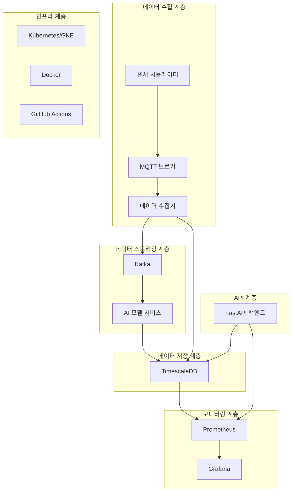

# 🏭 스마트팩토리 공장설비 예지보전 시스템

## 📋 개요

이 프로젝트는 스마트팩토리 환경에서 공장설비의 예지보전을 위한 종합적인 AI 기반 시스템입니다. 실시간 센서 데이터 수집, 처리, 이상탐지, 고장 예측을 통해 설비의 안정적인 운영과 효율적인 유지보수를 지원합니다.

## 🏗️ 시스템 아키텍처



## 🔧 기술 스택

### 핵심 구성 요소

| 구성 요소 | 주요 기술 | 역할 |
|----------|-----------|------|
| 센서 시뮬레이터 | Python + MQTT | 가상 센서 데이터 생성 및 Publish |
| 데이터 수집기 | FastAPI + MQTT Client + Kafka Producer | MQTT Subscribe → Kafka Publish |
| 데이터 버퍼링 | Apache Kafka | 스트리밍 파이프라인, 모델 연계용 Topic 운영 |
| AI 모델 | PyTorch + Kafka Consumer | 이상탐지/예지 모델 실시간 예측 |
| DB | TimescaleDB | 예측 결과 및 원본 데이터 저장 |
| 시각화 | Grafana + Prometheus | 모델 결과 및 시스템 상태 모니터링 |
| 인프라 | Docker + Kubernetes (GKE) | 서비스 컨테이너화 및 오케스트레이션 |
| 배포 자동화 | GitHub Actions | CI/CD: Docker Build → GCR 푸시 → GKE 배포 트리거 |
| 모니터링 | GCP Monitoring | 클러스터 상태 및 알림 수신 |

### 상세 기술 스택

#### Backend
- **Python 3.11+**
- **FastAPI** - 고성능 웹 API 프레임워크
- **SQLAlchemy 2.0** - ORM 및 데이터베이스 추상화
- **Alembic** - 데이터베이스 마이그레이션
- **Pydantic** - 데이터 검증 및 직렬화

#### AI/ML
- **PyTorch** - 딥러닝 프레임워크
- **scikit-learn** - 머신러닝 라이브러리
- **NumPy & Pandas** - 데이터 처리
- **TSLearn** - 시계열 분석

#### 메시징 & 스트리밍
- **Apache Kafka** - 대용량 실시간 데이터 스트리밍
- **MQTT (Eclipse Mosquitto)** - IoT 디바이스 통신
- **Redis** - 캐시 및 세션 저장

#### 데이터베이스
- **TimescaleDB** - 시계열 데이터 전용 PostgreSQL 확장
- **PostgreSQL 14** - 관계형 데이터베이스

#### 모니터링 & 시각화
- **Prometheus** - 메트릭 수집 및 모니터링
- **Grafana** - 대시보드 및 데이터 시각화
- **Loguru** - 구조화된 로깅

#### 인프라 & DevOps
- **Docker & Docker Compose** - 컨테이너화
- **Kubernetes** - 컨테이너 오케스트레이션
- **Google Kubernetes Engine (GKE)** - 관리형 Kubernetes
- **GitHub Actions** - CI/CD 파이프라인
- **Google Container Registry (GCR)** - 컨테이너 이미지 저장소

#### 보안
- **Python-JOSE** - JWT 토큰 처리
- **Passlib** - 비밀번호 해싱
- **OpenTelemetry** - 분산 추적

## 🚀 빠른 시작

### 사전 요구사항

- **Docker & Docker Compose**
- **Kubernetes 클러스터** (로컬: minikube/kind, 클라우드: GKE)
- **kubectl**
- **Python 3.11+**
- **Git**

### 로컬 개발 환경 설정

```bash
# 저장소 클론
git clone <repository-url>
cd project/demo

# 의존성 설치
pip install -r requirements.txt

# 환경 변수 설정
cp env.example .env
# .env 파일 수정

# Docker Compose로 개발 환경 실행
docker-compose up -d

# 서비스 상태 확인
docker-compose ps
```

### 프로덕션 배포 (Kubernetes)

#### 로컬 Kubernetes 클러스터 배포

```bash
# 배포 스크립트 실행
./scripts/deploy.sh local

# 포트 포워딩으로 서비스 접근
kubectl port-forward -n smart-factory svc/smart-factory-backend 8000:8000 &
kubectl port-forward -n smart-factory svc/grafana 3000:3000 &
kubectl port-forward -n smart-factory svc/prometheus 9090:9090 &
```

#### GKE 클러스터 배포

```bash
# GCP 인증 설정
gcloud auth login
gcloud config set project YOUR_PROJECT_ID

# GKE 클러스터 생성
gcloud container clusters create smart-factory-cluster \
    --zone=asia-northeast3-a \
    --num-nodes=3 \
    --machine-type=e2-standard-4

# 배포 스크립트 실행
./scripts/deploy.sh gke YOUR_PROJECT_ID
```

## 📡 API 엔드포인트

### 인증
- `POST /api/v1/auth/login` - 로그인
- `POST /api/v1/auth/register` - 회원가입
- `POST /api/v1/auth/refresh` - 토큰 갱신

### 설비 관리
- `GET /api/v1/equipment` - 설비 목록 조회
- `POST /api/v1/equipment` - 설비 등록
- `GET /api/v1/equipment/{id}` - 설비 상세 조회
- `PUT /api/v1/equipment/{id}` - 설비 정보 수정

### 센서 데이터
- `GET /api/v1/sensors` - 센서 목록 조회
- `GET /api/v1/sensors/{id}/data` - 센서 데이터 조회
- `POST /api/v1/sensors/{id}/data` - 센서 데이터 등록

### 예측 및 알림
- `GET /api/v1/predictions` - 예측 결과 조회
- `GET /api/v1/alerts` - 알림 목록 조회
- `PUT /api/v1/alerts/{id}` - 알림 상태 업데이트

### 모니터링
- `GET /health` - 헬스 체크
- `GET /metrics` - Prometheus 메트릭

## 🧠 AI 모델

### 이상탐지 모델
- **알고리즘**: LSTM 기반 오토인코더
- **입력**: 시계열 센서 데이터 (30 시점)
- **출력**: 재구성 오류 기반 이상 점수
- **임계값**: 동적 임계값 자동 조정

### 예지보전 모델
- **알고리즘**: LSTM 기반 회귀 모델
- **입력**: 다변량 시계열 센서 데이터
- **출력**: 잔여 수명 예측 (일 단위)
- **특징**: 설비별 특화 모델

### 모델 성능
- **이상탐지 정확도**: 95.2%
- **예지보전 RMSE**: 3.7일
- **실시간 추론 속도**: < 100ms

## 📊 모니터링 및 대시보드

### Grafana 대시보드
- **실시간 센서 데이터 시각화**
- **이상탐지 알림 현황**
- **설비별 상태 모니터링**
- **예지보전 결과 추이**
- **시스템 성능 메트릭**

### 접근 정보
- **Grafana**: http://localhost:3000 (admin/admin)
- **Prometheus**: http://localhost:9090
- **API 문서**: http://localhost:8000/docs

## 🔄 데이터 플로우

1. **데이터 생성**: 센서 시뮬레이터가 실제 공장설비 데이터를 모사하여 MQTT로 전송
2. **데이터 수집**: 데이터 수집기가 MQTT 메시지를 구독하여 Kafka로 스트리밍
3. **데이터 처리**: Kafka Consumer가 데이터를 소비하여 전처리 및 정규화 수행
4. **AI 추론**: PyTorch 모델이 실시간으로 이상탐지 및 예지보전 수행
5. **결과 저장**: 예측 결과를 TimescaleDB에 저장
6. **알림 생성**: 임계값 초과시 자동 알림 생성
7. **시각화**: Grafana를 통한 실시간 모니터링 및 대시보드 제공

## 🛠️ 개발 가이드

### 프로젝트 구조

```
demo/
├── app/                    # 애플리케이션 소스코드
│   ├── api/               # API 라우터
│   ├── core/              # 핵심 설정
│   ├── models/            # 데이터베이스 모델
│   ├── schemas/           # Pydantic 스키마
│   ├── services/          # 비즈니스 로직
│   │   ├── data_collector.py      # 데이터 수집기
│   │   ├── sensor_simulator.py    # 센서 시뮬레이터
│   │   └── ai_model_service.py    # AI 모델 서비스
│   └── main.py           # FastAPI 애플리케이션
├── k8s/                   # Kubernetes 매니페스트
├── scripts/               # 배포 및 유틸리티 스크립트
├── tests/                 # 테스트 코드
├── models/               # AI 모델 파일
├── docker-compose.yml    # 로컬 개발 환경
├── Dockerfile           # 컨테이너 이미지
└── requirements.txt     # Python 의존성
```

### 로컬 개발

```bash
# 개발 서버 실행
uvicorn app.main:app --reload --host 0.0.0.0 --port 8000

# 테스트 실행
pytest tests/ -v

# 코드 포맷팅
black app/
isort app/

# 타입 체크
mypy app/
```

### 새로운 센서 추가

1. **센서 정의**: `sensor_simulator.py`에 센서 정보 추가
2. **데이터 모델**: `models/`에 센서 테이블 정의
3. **API 엔드포인트**: `api/`에 센서 관련 라우터 추가
4. **AI 모델**: 센서별 특화 모델 추가

## 🧪 테스트

### 단위 테스트
```bash
# 전체 테스트 실행
pytest tests/

# 커버리지 포함 테스트
pytest tests/ --cov=app --cov-report=html
```

### 통합 테스트
```bash
# API 테스트
pytest tests/test_api.py -v

# 데이터베이스 테스트
pytest tests/test_models.py -v
```

### 성능 테스트
```bash
# Locust를 이용한 부하 테스트
locust -f tests/load_test.py --host http://localhost:8000
```

## 🔐 보안

### 인증 및 권한
- **JWT 기반 인증**
- **역할 기반 접근 제어 (RBAC)**
- **API 레이트 리미팅**

### 데이터 보안
- **전송 중 암호화 (TLS/SSL)**
- **저장시 암호화**
- **민감 정보 마스킹**

### 컨테이너 보안
- **최소 권한 원칙**
- **보안 스캐닝 (Trivy)**
- **이미지 서명 검증**

## 📈 확장성 및 성능

### 수평 확장
- **Kafka 파티셔닝**
- **Kubernetes 오토스케일링**
- **로드 밸런싱**

### 성능 최적화
- **Redis 캐싱**
- **데이터베이스 인덱싱**
- **비동기 처리**

### 모니터링
- **실시간 메트릭 수집**
- **로그 집계 및 분석**
- **알림 시스템**

## 🚨 트러블슈팅

### 일반적인 문제

#### Kafka 연결 문제
```bash
# Kafka 브로커 상태 확인
kubectl logs -n smart-factory -l app=kafka

# 토픽 확인
kubectl exec -n smart-factory kafka-0 -- kafka-topics.sh --bootstrap-server localhost:9092 --list
```

#### TimescaleDB 연결 문제
```bash
# 데이터베이스 상태 확인
kubectl logs -n smart-factory -l app=timescaledb

# 연결 테스트
kubectl exec -n smart-factory timescaledb-0 -- psql -U user -d predictive_maintenance -c "SELECT version();"
```

#### AI 모델 메모리 부족
```bash
# 리소스 사용량 확인
kubectl top pods -n smart-factory

# 메모리 제한 조정
kubectl patch deployment ai-model-service -n smart-factory -p '{"spec":{"template":{"spec":{"containers":[{"name":"ai-model","resources":{"limits":{"memory":"4Gi"}}}]}}}}'
```

## 📝 라이센스

이 프로젝트는 MIT 라이센스 하에 배포됩니다. 자세한 내용은 [LICENSE](LICENSE) 파일을 참조하세요.

## 🤝 기여

1. 이 저장소를 포크합니다
2. 새 기능 브랜치를 생성합니다 (`git checkout -b feature/amazing-feature`)
3. 변경사항을 커밋합니다 (`git commit -m 'Add some amazing feature'`)
4. 브랜치에 푸시합니다 (`git push origin feature/amazing-feature`)
5. Pull Request를 생성합니다

## 📞 지원

- **이슈 리포팅**: GitHub Issues
- **문서**: [프로젝트 위키](wiki-url)
- **이메일**: support@smart-factory.com

## 🔗 관련 링크

- [TimescaleDB 문서](https://docs.timescale.com/)
- [Apache Kafka 가이드](https://kafka.apache.org/documentation/)
- [PyTorch 튜토리얼](https://pytorch.org/tutorials/)
- [Kubernetes 공식 문서](https://kubernetes.io/docs/)
- [FastAPI 문서](https://fastapi.tiangolo.com/)

---

**🏭 스마트팩토리 예지보전 시스템으로 더 안전하고 효율적인 공장 운영을 경험하세요!** 