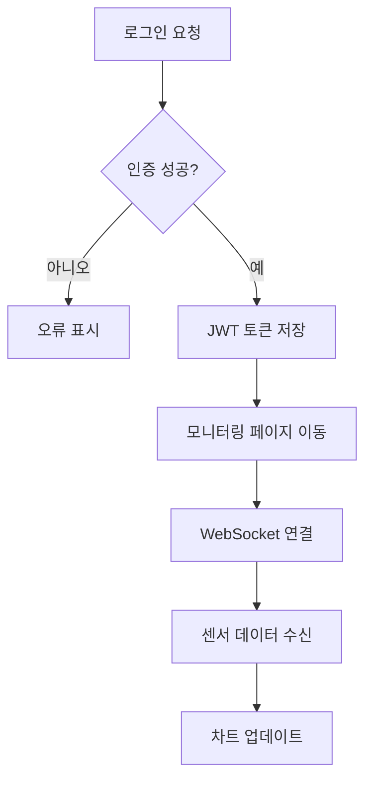

# Factory PdM 모니터링 대시보드

이 프로젝트는 회전체 장비의 예지보전을 위한 실시간 모니터링 대시보드를 제공합니다. WebSocket 으로 전달되는 센서 데이터를 받아 그래프와 알림 형태로 시각화합니다.

## 환경 설정

1. `.env.local` 파일을 생성합니다. 예시는 `.env.example` 을 참고하세요.

```bash
cp .env.example .env.local
```

2. `NEXT_PUBLIC_WEBSOCKET_URL` 에 WebSocket 주소를 입력하고 필요 시 `NEXT_PUBLIC_SENTRY_DSN` 값을 설정합니다.
   `NEXT_PUBLIC_` 으로 시작하는 변수는 브라우저에서 노출되므로 비밀 값은 사용하지 않습니다.

## 개발 모드 실행

의존성을 설치한 후 개발 서버를 실행합니다.

```bash
npm install
npm run dev
```

브라우저에서 [http://localhost:3000](http://localhost:3000) 으로 접속해 동작을 확인할 수 있습니다.

## 모의 WebSocket 서버

`public/mock-data.json` 데이터를 스트리밍하는 간단한 목 서버가 포함되어 있습니다. 별도의 터미널에서 다음 명령으로 실행합니다.

```bash
npm install
node scripts/mock-server.js
```

서버는 기본적으로 `ws://localhost:8080` 에서 대기하므로 `.env.local` 의 `NEXT_PUBLIC_WEBSOCKET_URL` 값도 동일하게 맞춰야 합니다.

## 백엔드 없이 UI 미리보기

가벼운 테스트 페이지들이 포함되어 있어 API 서버 없이도 화면을 확인할 수 있습니다. 개발 서버 실행 후 아래 경로를 열어보세요.

```
/monitoring/test
/anomalies/test
/equipment/test
/maintenance/test
```

각 페이지는 `public/` 폴더의 JSON 파일을 불러와 기본 화면을 렌더링합니다.

## 프로덕션 빌드

최적화된 빌드를 생성하고 실행하려면 다음 명령을 사용합니다.

```bash
npm run build
npm start
```

`npm start` 는 Next.js 의 내장 서버로 빌드된 앱을 제공합니다. 배포 방법은 [Next.js 문서](https://nextjs.org/docs/app/building-your-application/deploying) 를 참고하세요.

## 테스트 실행

테스트 전에는 의존성 설치와 빌드가 필요합니다.

```bash
npm install
npm run build
```

`package.json` 의 `pretest` 스크립트로 이 과정을 자동화할 수도 있습니다.

```json
"pretest": "npm run build"
```

이후 단위 테스트를 실행합니다.

```bash
npm test
```

## 프로젝트 구조

```
factory-PdM/
├── .github/                         # GitHub 설정
│   └── workflows/                   # CI/CD 워크플로우
│       ├── ci.yml                   # 테스트 및 빌드 자동화
│       └── deploy.yml               # 배포 파이프라인
├── cypress/                         # E2E 테스트 코드
│   ├── e2e/
│   │   └── login_dashboard_alert.cy.ts # 로그인과 알림 플로우 테스트
│   └── support/
│       └── e2e.ts                   # 공통 테스트 훅
├── public/                          # 정적 파일과 목 데이터
│   ├── devices/                     # 장비 예시 JSON
│   │   ├── EQ-1.json                # 장비 1 데이터
│   │   └── EQ-2.json                # 장비 2 데이터
│   ├── locales/                     # 다국어 번역 리소스
│   │   ├── en/common.json           # 영어 번역
│   │   └── ko/common.json           # 한국어 번역
│   ├── mock-alerts.json             # 경고 로그 예시
│   ├── mock-anomalies.json          # 이상 이벤트 예시
│   ├── mock-data.json               # 센서 스트림 목 데이터
│   ├── mock-devices.json            # 장비 목록 예시
│   ├── machines.json                # 설비 정보 예시
│   ├── mock-maintenance.json        # 정비 이력 예시
│   ├── file.svg                     # 예제 아이콘
│   ├── globe.svg                    # 언어 전환 아이콘
│   ├── logo.svg                     # 프로젝트 로고
│   ├── next.svg                     # Next.js 로고
│   ├── vercel.svg                   # Vercel 로고
│   └── window.svg                   # 창 모양 아이콘
├── scripts/                         # 보조 스크립트
│   ├── logger.js                    # 로그 포맷터
│   └── mock-server.js               # WebSocket 목 서버
├── src/                             # 애플리케이션 소스
│   ├── __tests__/                   # Jest 단위 테스트
│   │   ├── fetchWithAuth.test.ts    # 인증 HTTP 헬퍼 테스트
│   │   ├── monitoring.test.tsx      # 모니터링 페이지 테스트
│   │   ├── monitoringStatic.test.tsx # 정적 모니터링 테스트
│   │   ├── pages.test.tsx           # 라우팅 테스트
│   │   └── useWebSocket.test.tsx    # WebSocket 훅 테스트
│   ├── app/                         # Next.js App Router
│   │   ├── [locale]/                # 언어별 레이아웃
│   │   │   ├── layout.tsx           # 로케일별 레이아웃 컴포넌트
│   │   │   └── page.tsx             # 기본 페이지
│   │   ├── alerts/                  # 알림 목록 페이지
│   │   │   ├── page.tsx             # 알림 메인 화면
│   │   │   └── test/page.tsx        # 목 데이터용 테스트
│   │   ├── anomalies/               # 이상 징후 페이지
│   │   │   ├── page.tsx
│   │   │   └── test/page.tsx
│   │   ├── api/                     # 앱 내 API 라우트
│   │   │   ├── alerts/[id]/route.ts # 알림 상세 API
│   │   │   └── devices/[id]/threshold/route.ts # 임계치 수정 API
│   │   ├── devices/                 # 장비 목록·상세
│   │   │   ├── [id]/page.tsx        # 장비 상세 페이지
│   │   │   └── page.tsx             # 장비 목록 페이지
│   │   ├── equipment/               # 설비 관리 페이지
│   │   │   ├── page.tsx
│   │   │   └── test/page.tsx
│   │   ├── login/                   # 로그인 화면
│   │   │   └── page.tsx
│   │   ├── maintenance/             # 정비 내역 페이지
│   │   │   ├── page.tsx
│   │   │   └── test/page.tsx
│   │   ├── monitoring/              # 실시간 모니터링
│   │   │   ├── page.tsx
│   │   │   └── test/page.tsx
│   │   ├── not-found.tsx            # 404 처리
│   │   ├── page.tsx                 # 루트 페이지
│   │   ├── settings/                # 사용자 설정
│   │   │   └── page.tsx
│   │   ├── test/                    # UI 미리보기 레이아웃
│   │   │   └── layout.tsx
│   │   ├── favicon.ico              # 파비콘 이미지
│   │   ├── globals.css              # 전역 스타일
│   │   └── layout.tsx               # 앱 전체 레이아웃
│   ├── components/                  # 공통 React 컴포넌트
│   │   ├── AlertDetailsModal.tsx    # 알림 상세 모달
│   │   ├── ChartCard.tsx            # 센서 차트 카드
│   │   ├── DashboardLayout.tsx      # 대시보드 기본 레이아웃
│   │   ├── ErrorBoundary.tsx        # 오류 경계 컴포넌트
│   │   ├── Header.tsx               # 상단 헤더
│   │   ├── I18nProvider.tsx         # 다국어 컨텍스트
│   │   ├── LanguageSwitcher.tsx     # 언어 선택 드롭다운
│   │   ├── LogoutButton.tsx         # 로그아웃 버튼
│   │   ├── QueryProvider.tsx        # React Query 설정
│   │   ├── Sidebar.tsx              # 좌측 메뉴
│   │   ├── SummaryCard.tsx          # 요약 정보 카드
│   │   ├── ThemeToggle.tsx          # 다크모드 스위치
│   │   ├── filters/                 # 필터 UI 모음
│   │   │   ├── EquipmentFilter.tsx  # 장비 선택 필터
│   │   │   ├── SensorFilter.tsx     # 센서 종류 필터
│   │   │   ├── TimeRangeSelector.tsx # 기간 선택
│   │   │   └── index.ts             # 필터 모듈 엔트리
│   │   └── ui/                      # 기본 UI 컴포넌트
│   │       ├── button.tsx           # 버튼 스타일
│   │       ├── card.tsx             # 카드 컨테이너
│   │       ├── input.tsx            # 입력 필드
│   │       └── label.tsx            # 라벨 요소
│   ├── hooks/                       # 커스텀 React 훅
│   │   ├── useRequireRole.ts        # 권한 체크 훅
│   │   └── useWebSocket.ts          # WebSocket 상태 관리
│   ├── lib/                         # 유틸리티 라이브러리
│   │   ├── api.ts                   # fetch 래퍼
│   │   ├── dynamicRecharts.ts       # Recharts 동적 로딩
│   │   └── logger.ts                # 로깅 함수
│   ├── pages/                       # 기존 pages 라우트
│   │   └── api/
│   │       └── login.ts             # 로그인 API
│   ├── store/                       # Zustand 전역 상태
│   │   └── useAuthStore.ts          # 인증 상태 저장소
│   ├── i18n.ts                      # i18next 초기화
│   └── mockData.ts                  # 데모 데이터
├── cypress.config.ts                # Cypress 설정
├── eslint.config.mjs                # ESLint 규칙
├── jest.config.js                   # Jest 설정
├── jest.setup.js                    # Jest 초기 스크립트
├── next-i18next.config.mjs          # i18n 플러그인 설정
├── next.config.ts                   # Next.js 설정
├── postcss.config.mjs               # PostCSS 설정
├── tailwind.config.js               # Tailwind 구성
├── tsconfig.json                    # TypeScript 옵션
├── package.json                     # 프로젝트 메타정보
├── package-lock.json                # 의존성 잠금 파일
├── sentry.client.config.ts          # 브라우저용 Sentry 설정
├── sentry.server.config.ts          # 서버용 Sentry 설정
└── LICENSE                          # 라이선스 전문
```

각 파일과 폴더는 위 주석에서 설명한 역할을 수행하며, 이를 기반으로 대시보드 기능을 구성합니다.

## 라이선스

이 프로젝트는 [MIT License](LICENSE)로 배포됩니다.

## 회전체 장비 예지보전 시스템 – 기능 단위 정리

아래 표는 예지보전 시스템 구축 시 고려한 주요 기능을 단계별로 요약한 것입니다. 백엔드부터 프론트엔드, 운영 관리까지 전 과정을 포괄합니다.

### 1. 센서 데이터 시뮬레이션 및 수집

| 기능 | 설명 | 사용 기술 |
| --- | --- | --- |
| 센서 시뮬레이터 구현 | 진동, 온도, 전류 등의 센서 값을 생성하며 이상 패턴도 주입 | Python |
| MQTT 브로커 연동 | 시뮬레이터 데이터를 실시간 전송 | Mosquitto MQTT |
| 실시간 구독 및 처리 | FastAPI에서 MQTT 구독 후 데이터 수신 · 저장 | paho-mqtt, FastAPI |

### 2. 데이터 저장 및 전처리

| 기능 | 설명 | 사용 기술 |
| --- | --- | --- |
| 시계열 데이터 저장 | 센서 값을 시간 순서로 기록 (하이퍼테이블 구조) | TimescaleDB |
| 이상/고장 로그 저장 | 이상 감지 및 예측 결과 기록 | PostgreSQL + SQLAlchemy |
| 기본 전처리 로직 | 결측치 제거, 정규화, 슬라이딩 윈도우 구성 | Pandas, Numpy |

### 3. 이상 감지 및 예지보전 모델

| 기능 | 설명 | 사용 기술 |
| --- | --- | --- |
| 이상 탐지 모델 | Isolation Forest 또는 Autoencoder 기반 비지도 학습 | Scikit-learn, PyTorch |
| 예지보전(RUL) 예측 | 시계열 데이터 기반 남은 수명 예측 | LSTM (PyTorch) |
| 모델 출력 구조화 | 예측 결과를 API 응답 및 DB 저장 형식으로 변환 | Pydantic, JSON |

### 4. API 서버 및 시스템 통합

| 기능 | 설명 | 사용 기술 |
| --- | --- | --- |
| API 제공 | 센서 데이터 조회, 이상 이벤트, 예측 결과 제공 | FastAPI |
| Swagger 자동 문서화 | API 스펙 자동 생성 및 테스트 지원 | FastAPI 내장 기능 |
| 비동기 처리 | 실시간 데이터 수신에 대응하는 async/await 구조 | FastAPI |

### 5. 프론트엔드 대시보드

| 기능 | 설명 | 사용 기술 |
| --- | --- | --- |
| 실시간 센서 그래프 | 장비별 진동, 온도, 전류 시계열 그래프 | Next.js + Recharts |
| 이상 탐지 알림 로그 | 이상 발생 시 시간과 상태 표시 | Zustand + Tailwind UI |
| RUL 예측 시각화 | 남은 수명 예측 결과를 그래프로 표시 | Recharts |
| 경고 등급 색상/태그 처리 | 위험도에 따른 시각적 구분 | Tailwind, 조건 렌더링 |

### 6. 알림 시스템 연동

| 기능 | 설명 | 사용 기술 |
| --- | --- | --- |
| Email 알림 발송 | 이상 탐지 시 관리자에게 이메일 전송 | SMTP (Python email) |
| 알림톡 연동 | 고위험 상황 시 카카오 알림톡 전송 (선택 사항) | 카카오 비즈니스 API |

### 7. 시스템 모니터링 및 운영관리

| 기능 | 설명 | 사용 기술 |
| --- | --- | --- |
| FastAPI 상태 모니터링 | 요청 수, 응답 속도, 오류율 수집 | Prometheus Exporter |
| DB 상태 감시 | 쿼리 속도와 디스크 사용량 모니터링 | PostgreSQL Exporter |
| 통합 대시보드 시각화 | Grafana로 시스템 상태 확인 | Grafana |
| 이슈 로깅 및 관리 | GitHub Issues 기반 오류 이력 관리 | GitHub Issues, 커밋 로그 |

**모델/장비별 모듈화**는 모터 → 펌프 → 베어링 등으로 확장 가능하며, 실제 공장 센서 연동 구조(MQTT + Docker)에 맞춰 엣지 컴퓨팅(Raspberry Pi 등) 도입도 고려했습니다.
## 파일/폴더 역할과 상호 연관성

- `src/app/layout.tsx` 는 앱 전반에 공통으로 적용되는 `QueryProvider`와 `I18nProvider`를 로드합니다. 이를 통해 모든 페이지에서 React Query와 다국어 기능을 사용할 수 있습니다.
- `QueryProvider`는 `@tanstack/react-query`의 `QueryClient`를 생성해 하위 컴포넌트에 전달합니다.
- `I18nProvider`는 `src/i18n.ts` 설정을 기반으로 번역 리소스를 로딩합니다. 번역 파일은 `public/locales/*`에 위치합니다.
- 각 페이지(`src/app/*/page.tsx`)는 `DashboardLayout`을 사용해 헤더와 사이드바를 포함한 공통 레이아웃을 적용합니다. `DashboardLayout` 내부에서 `Sidebar`와 `Header`가 함께 렌더링됩니다.
- `Sidebar`와 `Header`는 `LanguageSwitcher`, `ThemeToggle`, `LogoutButton` 등 여러 UI 컴포넌트와 연결됩니다.
- 페이지 진입 시 `useRequireRole` 훅을 호출하여 현재 사용자의 권한(`useAuthStore`에서 관리)이 적절한지 확인하고, 아니라면 `/monitoring`으로 리다이렉트합니다.
- `useWebSocket` 훅은 `src/lib/logger.ts`의 로깅 함수를 활용하여 WebSocket 상태를 기록하며, 실시간 데이터 흐름을 `MonitoringPage`와 `DeviceDetailPage` 등에 제공합니다.
- `fetchWithAuth` 함수는 `localStorage`에 저장된 JWT 토큰을 읽어 `Authorization` 헤더를 설정합니다. 이 함수는 `DeviceDetailPage`에서 임계치 변경 API(`/api/devices/[id]/threshold`) 호출에 사용됩니다.
- 로그인 페이지는 `/api/login` 엔드포인트에 요청을 보내 토큰을 받으며, 발급된 토큰은 `localStorage`에 저장되어 이후 API 호출에서 재사용됩니다.

### 유스 케이스 다이어그램

```mermaid
usecaseDiagram
  actor 사용자
  actor "API 서버" as API서버
  actor "WebSocket 서버" as WebSocket서버

  사용자 --> (로그인)
  (로그인) --> API서버

  사용자 --> (모니터링 보기)
  (모니터링 보기) --> WebSocket서버

  사용자 --> (장비 임계치 변경)
  (장비 임계치 변경) --> API서버

  사용자 --> (보고서 조회)
  사용자 --> (설정 변경)
```

### 활동 다이어그램: 로그인 후 모니터링 흐름


